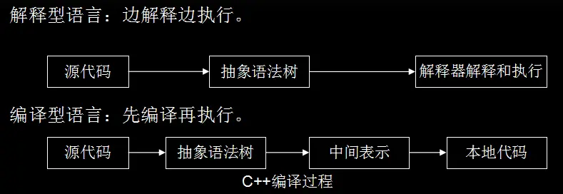

## JavaScript引擎
- CPU并不认识我买的js代码，而不同的CPU只认识自己对应的指令集
- JavaScript引擎将js代码编译成CPU认识的指令集
- 除了编译之外还要负责执行以及内存的管理
  - js是解释型语言，由引擎直接读取源码，一边编译一边执行，因而效率较低
  - 编译型语言如C++是把源码直接编译成科直接执行的代码，因而执行效率较高

## AST的概念
### 什么是AST
- 抽象语法树（Abstract Syntax Tree，AST）是源代码的抽象语法结构的树状表现形式
- 是计算机科学中的一个概念，不是V8引擎特有；更不是javascript特有；

## 字节码
### 什么是字节码
- 字节码(Bytecode)通常指的是已经经过编译，但与特定机器代码无关，需要解释器转译后才能成为机器代码的中间代码。字节码不像源码一样可以让人阅读，而是编码后的数值常量、引用、指令等构成的序列。
- 计算机只能识别二进制代码，而二进制代码（指令集）是不合适人类书写和阅读的，不同的CPU架构对应的指令集也是完全不同的，为了客服这个问题，大神们就创造出了适合人类的语言，也就是所谓的“高级”语言，这些高级语言与人类的自然语言及数学公式的使用是非常接近的，且不用考虑CPU架构的差异；而高级语言和二进制代码之间的差异是相当大的，直接转换会非常麻烦，这时就有了二者的中间代码————字节码
### 字节码的优势
- 不针对特定的CPU架构
- 比原始的高级语言转换成机器码语言更快
### 样本参考
- java虚拟机JVM